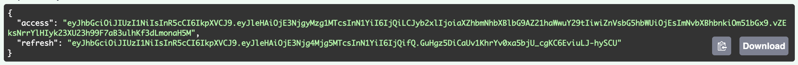
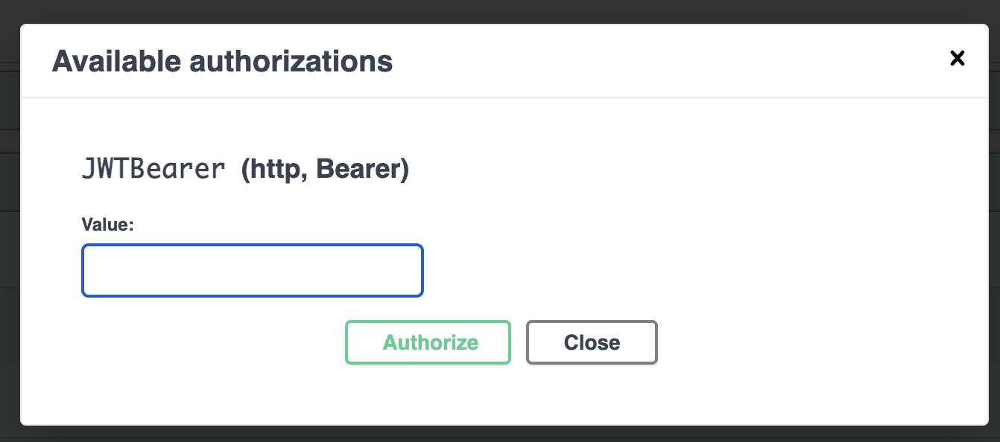
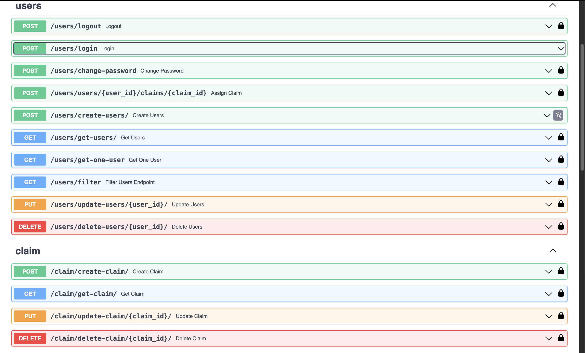

# Shipay-Challenge | Back-End

## Tecnologias Usadas

- Python
- Fastapi
- Postgresql
- Docker

## As credenciais desse projeto estão todas direcionadas para o container. Quando for para produção, é necessário alterações.

## Executando via Docker Compose (Rencomendável)

1. Vá até a raíz do projeto e execute

> sudo docker compose up

2. Caso precise reconstruir a imagem execute

> sudo docker compose up --build

### Obs: a imgem já está com reload, não precisa ficar rebuildando

## Executando via Docker

1. Faça o build da image Docker que está na raiz do projeto

 > docker build -t shipay-app .

2. Execute a imagem Docker que foi construida

 > docker run -p 8080:8080 shipay-app

## Como executar o projeto sem o Docker

1. Ir até a pasta do projeto e criar a virualenv

> virtualenv venv

2. Ative a virtualenv

> source venv/bin/activate

3. Instale as dependencias

> pip install -r requirements.txt

4. Na raiz do projeto, onde estiver o arquivo main.py execute: 

> python main.py

### Se sua distribuição adotar o PEP 668 

1. Ir até a pasta do projeto e criar a virualenv
> python3 -m venv .venv

2. Ative a virtualenv
> source .venv/bin/activate

3. Instale as dependencias

> python3 -m pip install -r requirements.txt

4. Na raiz do projeto, onde estiver o arquivo main.py execute: 

> python3 -m main

* Teste local

> http://127.0.0.1:8080/docs

## Como fazer migrações no banco de dados

1. Execute o comando para criar o arquivo de migração no versions

> alembic revision -m "<nome-da-migraçao>"

2. Depois de criada a migração execute

> alembic upgrade head --sql

> alembic upgrade head

### Obs: para que as migrações funcionem, é necessário ir até o arquivo alembic.ini e na variável sqlalchemy.url (linha 63), adicionar a url do seu banco de dados

# Autenticação da API 

1. O primeiro passo para utilizar a REST API é indo até o endpoint users/login, inserir seu email e senha

2. Com isso, um token de acesso será gerado, um de acesso e outro de refresh.

3. Em quase todos os endpoints é possível ver um código na lateral direita. Para utilizar o token de acesso, basta clicar em qualquer deles, e surgira um popup para inserção do token. 

4. Ao inserir e clicar em Authorize, toda a API será liberada e está pronta para utilização. 

